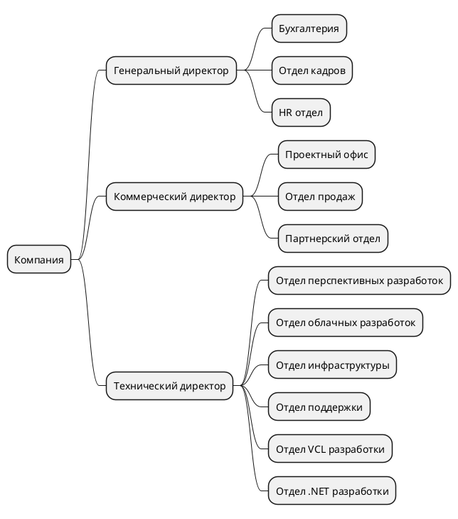
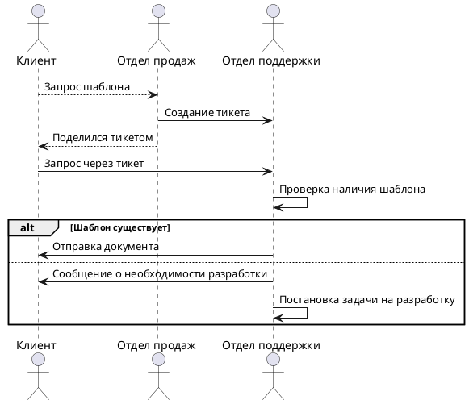
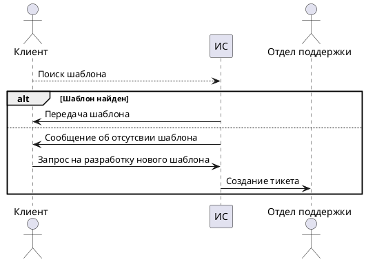
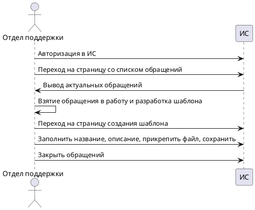
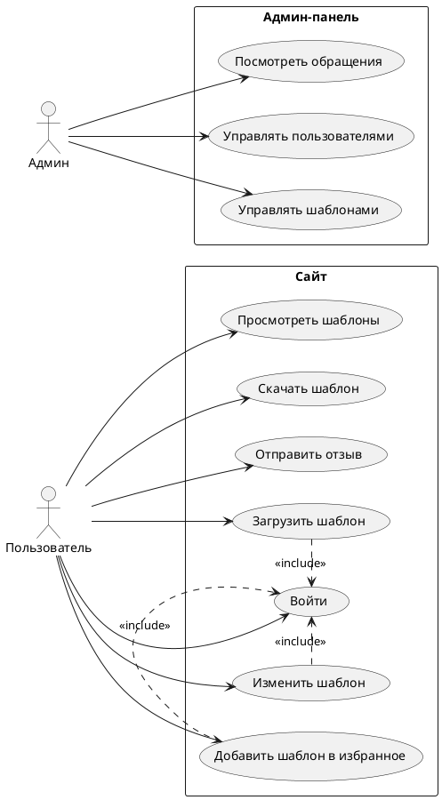

# Бизнес анализ

Проект: Разработка информационной системы управления пользовательскими шаблонами отчетов на базе продуктов ООО "Быстрые отчеты"

## 1. Определения
Шаблон отчета - xml документ в формате .frx, используемый для дизайна будущего документа продуктами семейства FastReports

## Структура предриятия
Структура предприятия определена следующим образом

## Продуктовый ряд
Разработкой продуктых решений занимаются отделы .NET, VCL, облака, некоторые пользовательские решения разрабатся так же внутри отдела инсфраструктуры
2.1. FastReport .NET
2.2. FastReport VCL
2.3. Desktop designer
2.4. Online designer
2.5. FastReports CLoud

## Анализ потребностей
Далее анализ подребностей будет проводится со стороны отдела инфраструктуры

Кейс: Клиенты обращаются в отдел продаж и поддержки с просьбой поделиться с ними типовыми шаблонами, например, ТОРГ-12
Диаграма текущего фроу работы с обращением:

Описание схемы:
Клиент обращается в отдел продаж с вопросом о существовании типового шаблона
Отдел продаж создает тикет в поддержку и передает тикет клиенту
Поддержка проверяет наличие шаблона во внутренней системе
Если шаблон есть - отправляет его пользователю в тикете
Если шаблон отсутствует - поддержка создает задачу на разработку шаблона и сообщает об этом пользователю

Требуется оптимизировать процесс
Требования:
- сократить до минимума коммуникацию клиента и сотрудников компании по данному процессу
- исключить коммуникацию отдела продаж и поддержки по данному процессу

Решением было создать информационную систему управления шаблонами

## Формирование решения

В качестве способа оптимизации процесса было принято решения о разработки информационной системы "Система управления пользовательскими шаблонами отчетов"

### Основной процесс 
Получение пользователем необходимого шаблона

Описание процесса:
Пользователь заходит на сайт, в поле поиска вбивает ключевое слово
Система ищет подходящие шаблоны и возвращает пользователю
Если запрос пользователя удовлетворен - он скачивает необходимый шаблон
Если запрос пользователя не удовлетворен - он может отправить запрос на разработку необходимого шаблона
При отправке запроса ИС в системе поддержки создаст тикет на разработку шаблонаэ

### Второстепенный процесс
Создание и загрузка шаблонов в систему

Описание процесса:
Сотрудник поддержки переходит в админ-панель ИС
Переходит на страницу со списком обращений и берет в работу одно из них
В рамках своего инструментария подготавливает шаблон по запросу пользователя
Загружает шаблон в ИС на странице создания шаблона, заполнив необходимые поля 

## Функциональные требования

Необходимо разработать ИС со следующими функциональными подсистемами

### Подсистема 1: Админ панель
Функциональные блоки подсистемы:
1. Авторизация
2. Работа с шаблонами
    1. Просмотр списка загруженных шаблонов
    2. Создание шаблона
    3. Редактирование атрибутов шаблона
    4. Удаление шаблона
3. Работа с обращениями
    1. Просмотр списка актуальных обращений
    2. Возможность пометить обращение как "исполненное"
    3. Возможность пометить обращение как "отказанное"

Веб-страницы подсистемы:
1. Главная - список обращений
2. Просмотра обращения
3. Список шаблонов
4. Просмотр шаблона
5. Редактирование шаблона
6. Создания шаблона
### Подсистема 2: Сайт
Функциональные блоки подсистемы:
1. Работа с шаблонами
    1. Просмотр списка шаблонов
    2. Скачивание шаблона
2. Работа с обращениями
    1. Отправить обращение

Веб страницы подсистемы:
1. Главная - список шаблонов
2. Просмотр шаблона
3. Создание обращения 
