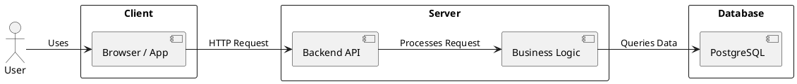

# Системный анализ

## 1. Архитектура
Для реализации сервиса была выбрана клиент-серверная модель, где:
Клиент - браузер пользователя, в котором исполняется клиентский код
Сервер - прикладное приложение, обрабатывающее запросы пользователя и работающий с базой данных



## 2. Технологии
Для разработки был выбран следующий стек технологий:

Для реализации сервиса потребуется следующий инструментарий:
1. Язык для бэкенда
 1. Фреймворк
 2. База данных
 3. ORM
2. Язык для фронденда
 1. UI фреймворк
 2. Инструмент для реализации админ-панели

### 1. Язык для бэкенда: Python
Критерии выбора:
- быстрое прототипирование
- популярность в web
- опыт использования

По данному критерию можно выделить несколько языков, которые подходят под критерии выше
- ruby
- php
- python
- go

Среди них я бы отдельно выделил python, так как с ним легче провести демонстрацию проделанной работы, что в рамках текущего проекта является весомым преимуществом

### 1.1. Фреймворк: Django
Для реализации функциональных требований нужен инструмент для создания api и реализации админ-панели
Под api существуют множество решений, таких как Flask, Fast-api, но django выделяется среди них возможностью использования django admin, что позволяет сократить обьем работы для реализации админ-панели

### 1.2. База данных
В качестве базы данных предпочтительна реляционная модель 
Среди популярных реляционных СУБД стоит выделить:
- mysql
- postgresql
- sqlite

Так как у проекта отсутствуют специальные требования к производительности, конкурентному доступу к данным, а так же, к их специальным возможностям выбор сделан в пользу sqlite из-за портативности и отсутствию требований к дополнительной установке самой СУБД

### 1.3. ORM: Django ORM
Критерием для анализа выступало удобство работы в django, django orm в этом плане вне конкуренции из-за консолидации документации в паре с django
Иные решения вроде sqlalchemy или peewee данным свойством не обладают и чаще используются в паре с другими веб-серверами

### 2. Язык для фронтенда: React
Javascript по сути является единственным решением для реализации фронтенда, если не брать в рассчет технологии на базе WASM
Среди веб фреймворков для javascript более 10 лет держит первернство React

### 2.1. UI фреймворк
Для анализа были выбраны 3 UI фреймворка:
- bootstrap
- tailwind
- material ui

Bootstrap уже около 13 лет является популярным решением для реализации интерфейсов в web, имеет достаточной набор готовых компонентов для прототипировния сервисов
Tailwind обладает гибкостью и удобством для создания собственной библиотеки компонентов, популярные бесплатные наборы сейчас на уровне bootstrap
Material UI на текущий момент в экосистеме React обладает популярностью, пятикратно превышающий Bootstrap, стоит остановиться на material ui


## 3. API Контракты 
Далее описаны API контракты для взаимодействия клиента и сервера

### **1. Получить список шаблонов**
| Метод  | Путь         | Запрос        | Ответ  |
|--------|------------|--------------|--------|
| GET    | /templates | `{ query }`     | `[{ id, name }]` |

| Параметр  | Тип     | Обязательный | Описание                 |
|-----------|---------|--------------|--------------------------|
| `query`      | string  | Нет           | Подстрока для фильтра по названию 


#### Пример запроса:
```json
curl -X GET "https://api.example.com/template?query=торг"
```

#### Пример ответа:
```json
[
    {
        "id": "123",
        "name": "ТОРГ-12",
        "preview_link": "https://placehold.co/600x400"
    }
]
```

### **2. Скачать шаблон**

| Метод  | Путь         | Запрос        | Ответ  |
|--------|------------|--------------|--------|
| GET    | /templates/{id}/download | `{ id }`     | Файл (`application/xml`) |

| Параметр  | Тип     | Обязательный | Описание                 |
|-----------|---------|--------------|--------------------------|
| `query`      | string  | Нет           | Подстрока для фильтра по названию |
#### Пример запроса:
```json
curl -X GET "https://api.example.com/templates/123/download" \
     -H "Accept: application/xml" \
     -o template.frx
```

#### Пример ответа:
Файл в формате .frx

### **3. Оставить обращение**
| Метод  | Путь         | Запрос        | Ответ  |
|--------|------------|--------------|--------|
| POST    | /reviews | `{ email, title, body }`     | `{ id }` |

| Параметр  | Тип     | Обязательный | Описание                 |
|-----------|---------|--------------|--------------------------|
| `email`      | string  | Да           | Email отправителя |
| `title`      | string  | Да           | Заголовок обращения |
| `body`      | string  | Да           | Текст обращения |
#### Пример запроса:
```json
curl -X POST "https://api.example.com/reviews" \
     -H "Content-Type: application/json" \
     -d '{
           "email": "user@example.com",
           "title": "Проблема с шаблоном",
           "body": "Не удаётся скачать шаблон ТОРГ-12. Ошибка 500."
         }'
```

#### Пример ответа:
```json
{
    "id": "456"
}
```

## 4. Физическая модель данных
Далее описана схема базы данных
### **1. Таблица `templates` (Шаблоны)**  

| Поле          | Тип            | Описание                         |
|--------------|---------------|---------------------------------|
| `id`        | `INTEGER PRIMARY KEY` | Уникальный идентификатор шаблона |
| `name`      | `TEXT NOT NULL` | Название шаблона |
| `preview_link` | `TEXT NOT NULL` | Ссылка на превью
| `file_path` | `TEXT NOT NULL` | Путь к файлу `.frx` на сервере |
| `created_at` | `TEXT DEFAULT (datetime('now')` | Дата создания |
| `updated_at` | `TEXT DEFAULT (datetime('now')` | Дата обновления |

#### **Индексы:**
- `INDEX name_idx (name)` - для быстрого поиска по названию.

---

### **2. Таблица `reviews` (Обращения)**  

| Поле     | Тип                     | Описание                       |
|---------|------------------------|-------------------------------|
| `id`    | `INTEGER PRIMARY KEY`     | Уникальный идентификатор обращения |
| `email`  | `TEXT NOT NULL` | Email отправителя |
| `title`  | `TEXT NOT NULL` | Заголовок обращения |
| `body`   | `TEXT NOT NULL`         | Текст обращения |
| `created_at` | `TEXT DEFAULT (datetime('now')` | Дата создания |

---

### **SQL-схема**  (sqlite) 


```sql
CREATE TABLE templates (
    id INTEGER PRIMARY KEY AUTOINCREMENT,
    name VARCHAR(255) NOT NULL,
    preview_link TEXT,
    file_path TEXT NOT NULL,
    created_at TEXT DEFAULT (datetime('now')),
    updated_at TEXT DEFAULT (datetime('now'))
);

CREATE INDEX name_idx ON templates (name);

CREATE TABLE reviews (
    id INTEGER PRIMARY KEY AUTOINCREMENT,
    email VARCHAR(255) NOT NULL,
    title VARCHAR(255) NOT NULL,
    body TEXT NOT NULL,
    created_at TEXT DEFAULT (datetime('now'))
);
```
