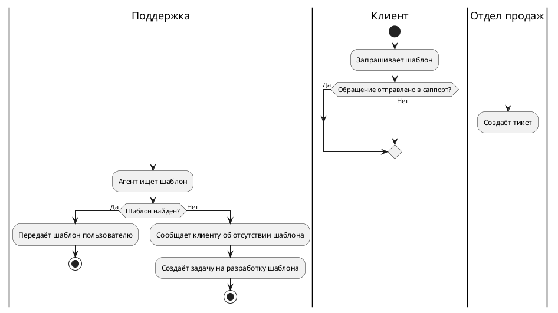

```plantuml
@startuml
|Поддержка|
|Клиент|
start
:Запрашивает шаблон;

if (Обращение отправлено в саппорт?) then (Да)
|Поддержка|
  
else (Нет)
  |Отдел продаж|
  :Создаёт тикет;
  |Поддержка|
endif
  :Агент ищет шаблон;

|Поддержка|


if (Шаблон найден?) then (Да)
  |Поддержка|
  :Передаёт шаблон пользователю;
  stop
else (Нет)
  |Поддержка|
  :Сообщает клиенту об отсутствии шаблона;
  :Создаёт задачу на разработку шаблона;
  stop
endif
@enduml


```